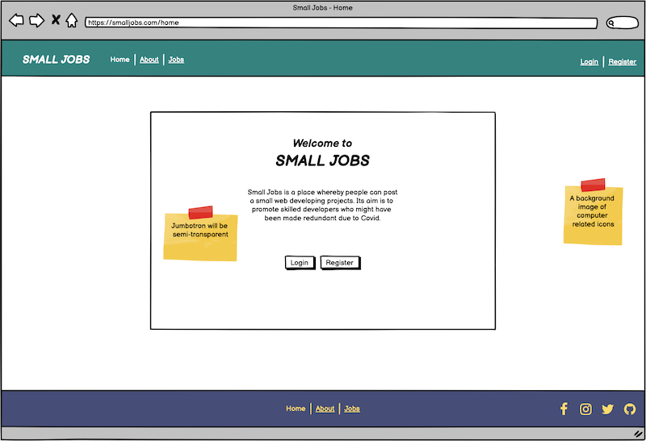

# Small Jobs

[Small Jobs - Live Site](https://small-jobs-project.herokuapp.com/)

---

## Contents

- [About the Project](#about-the-project)

- [User Experience](#user-experience)
    - [Project Outline](#project-outline)
    - [User Stories](#user-stories)
    - [Wireframes](#wireframes)
    - [Website Design](#website-design)

        - [Colour Scheme](#colour-scheme)

        - [Typography](#typography)
- [Website Features](#website-features)
- [Database Design](#database-design)
- [Technologies Used](#technologies-used)
- [Deployment](#deployment)
- [Testing](#testing)
- [Credits](#credits)

---

# About the Project

Small Jobs is a place whereby people can post a small web developing projects. Think of it as a jobs notice board you might find on a wall in your local community hall or college. Its aim is to promote jobs to skilled developers who might have been made redundant due to Covid. So that's the basic idea of Small Jobs, it's not meant to be flashy with all bells and whistles, I'll leave that to LinkedIn.

[^ back to contents ^](#contents)

---

# User Experience

## Project Outline

Small Jobs is a web application aimed at developers who may have been made redundant due to the ongoing Covid pandemic. Visitors to the website will be users looking for a small job, nixer or freelance job, something to keep their developing skills in tip-top shape. Job listings are available to all visitors without having to register, but once registered users can create, edit or delete a job post. 

All design decisions have been made with the following goals in mind:
- To be accessible to users with disabilities

- Easy to find your way around
- Responsiveness design

## User Stories

### User experience

- Consistent design across the website

- Easy to navigate with menu items easily accessible
- Intuitive - First time learning
- Responsive design across all devices
- Visually appealing

### As a first-time visitor I want

- To immediately understand what the purpose of the site is and what it can provide.

    - As a first time user, the main purpose of the website is all displayed on the homepage. If the site is not what they thought it was they can easily exit without having to go throughout the website.

    

- To see all content without having to register.

    - As a first time user, all job posts are made public to without having to register. This I feel is an important part of the UX as it gives the user a feel for the application, how the jobs work without feeling obliged to register. If it is a website for them, then they can proceed and register.

    

    - By tapping on, or clicking on a job post, the job "pops out" containing the full job description. Tapping the job again, closes the job. It would have been just as easy to display the jobs' content in a table, but I like the interactivity of this. It also keeps things nice and compact.

    - Job posts contain all relevant information such as contact name, contact email and a brief description of their requirements. 

    

- To be able to search for keywords.

    - If the website ends up being populated with many job posts, the best way to filter through these post is to have a search field that returns a given query.  

      

- To be able to register easily without needing to input lots of information.

    - A good feature of UX in regards to filing out online forms, is to have it as simple as possible. Often times, if there's too much information to input, this has the tendency to turn your potential new user away. My registration form takes in two fields, your username and a password.

    

### As a returning user I want

- To log in and out easily
    - If you want your to keep coming back, as good UX practice, like the register page, you want to keep the login page simple as well. The user wouldn't bother returning if they had to fill out a long form just to login agaim. So I've just added two fields, which keeps things nice and consistent.

    

- To be able to add new job posts
    - Creating a new job post is a simple process with a user friendly form.

    

- To be able to edit or delete job posts I have added
    - If a user makes a mistake with their post or manages to get someone to carry out their requirements, they can either edit it, or mark it as done which deletes the job.

 |                   |  
--------------- | -------------------------------- | ---------------

- To be able to see all the jobs I have created in one place

### As the site Admin I want:

- To be able to edit or remove content created by users. To be able to add, edit or remove categories
    - The site admin has full control over the site. They have the ability to remove job posts created by other users. They also have the ability to create edit or completely remove categories.

[^ back to contents ^](#contents)

---

# Wireframes

Wireframes designed for **mobile**, **tablet** and **desktop** created at the initial design phase.

[^ back to contents ^](#contents)

---

# Website Design

The website will be designed with the help of a [Materialize](https://materializecss.com/). A modern responsive front-end framework based on Material Design. Very much similar to Bootstrap although maybe not as well known, it comes with some excellent features.

Pages on the website will be:
- home
- about
- jobs
- login
- register

Design will be consistent across all devices making sure that users dont get lost as they navigate throughout the site.

## Colour scheme

After going through a few different colour schemes on [coolers.co](https://coolors.co/) I eventually chose the below palette. I like it because the colours aren't too serious but at the same time they are quite classy. The off-white is appealing as it's not going to hurt the eyes with the way pure white can sometimes be. The shades of purple, green and yellow say success to me and the tan colour compliments the off white.

Below is a wireframe of how I see the colours working together on the website.

## Typography 

For the websites fonts I will be using the tried and trusted Roboto for the headings, body text, menu and links. It's a well designed font which makes reading text on screens easier on the eyes. I find that serif fonts work best across all screens whether they have retina displays or not as there's little to no pixelation.

**About Roboto:** Roboto has a dual nature. It has a mechanical skeleton and the forms are largely geometric. At the same time, the font features friendly and open curves. While some grotesks distort their letterforms to force a rigid rhythm, Roboto doesn’t compromise, allowing letters to be settled into their natural width. This makes for a more natural reading rhythm more commonly found in humanist and serif types.
https://fonts.google.com/specimen/Roboto#about

For the website logo I will be using the font Lobster. It's a fun font, not to be taken too seriously.

**About Lobster:** The Lobster font took a different approach. The new OpenType format gives us the possibility to have multiple versions of each letter, and that's exactly what we are doing: Instead of compromising the design of our letters to force connections, we do what lettering artist do. We draw many versions of each letter and a lot of different letter-pairs (aka "ligatures") so we always use the best possible variation of each letter depending of the context of the letter inside each word. All this happens automatically in any browser that supports ligatures. 
https://fonts.google.com/specimen/Lobster#about

All fonts have been obtained from [Google Fonts](https://fonts.google.com/)

[^ back to contents ^](#contents)

---

## Database Design

Database design information goes here

[^ back to contents ^](#contents)

---

## Website Features

**1. Secure Passwords**

When registering for the site, the user's password is hashed so that it is not revealed within the MongoDB.

**2. CRUD Functionality**

Visitors can:
- View all job posts

Users can:
- Create their own job post

- Edit their own job post 
- Delete their own job post

The admin can:
- Add their own job posts

- Edit any users' job posts
- Delete any users' job posts

**3. Responsive Menu:**
- A responsive menu will be implemented across the website so that on mobile devices the menu items will collapse down into a clickable button, or what is sometimes referred to as, as a "hamburger" menu. When a user clicks on a relevant link, they will then be redirected to the coresponding page. Om mobile devices when the menu is tapped, the items will slide out from the right of the screen.

**4. 404 And 500 Error Pages:**
- If a user inadvertently types in a wrong link into their broweser, I feel its good UX if that user is kept on your website with a link back to maybe the homepage. Websites that don't implement this, when a user is met with a generic error page, more often than not, they leave the website, typing an alternative address into the browser thinking that your website has gone down. 

**5. Profile Pictures:**
- If I have the time, I would like to figure out how to have users upload their own profile picture. And then to be able to delete and upload a new one if they wish. This also promotes good UX as it gives the user a feeling of ownership.

[^ back to contents ^](#contents)

---

# Technologies Used

## Languages

- [CSS](https://developer.mozilla.org/en-US/docs/Web/CSS)

- [HTML](https://developer.mozilla.org/en-US/docs/Web/HTML)
- [Javascript](https://developer.mozilla.org/en-US/docs/Web/JavaScript)
- [Python](https://www.python.org/)
- [Jinja](https://jinja.palletsprojects.com/en/2.11.x/)

## Frameworks

- [Flask](https://palletsprojects.com/p/flask/)

- [jQuery](https://jquery.com/)
- [Materialize](https://materializecss.com/)

## Project management

- [Amazon AWS](https://aws.amazon.com/)

- [Balsamiq](https://balsamiq.com/wireframes/)
- [GitHub](https://github.com/)
- [GitPod](https://gitpod.io/)
- [Heroku](https://www.heroku.com/about)
- [MongoDB](https://www.mongodb.com/)

## Tools

- [Techsini](http://techsini.com/multi-mockup/index.php)

- [Coolers.co](https://coolors.co/1a237e-79b791-ee6055-214e34-f1edee)
- [Favicon.io](https://favicon.io//)
- [Font Awesome](https://fontawesome.com/)
- [Google Fonts](https://fonts.google.com/)
- Preview on Mac to resize images

[^ back to contents ^](#contents)

---

# Deployment 

Deployment information goes here

[^ back to contents ^](#contents)

---

# Testing

Full details on the relevant testing can be found here: [Testing](TESTING.md)

[^ back to contents ^](#contents)

---

# Credits

## Resources

Obtained the background image from this free website https://wallpaperaccess.com/whatsapp

[^ back to contents ^](#contents)

---
