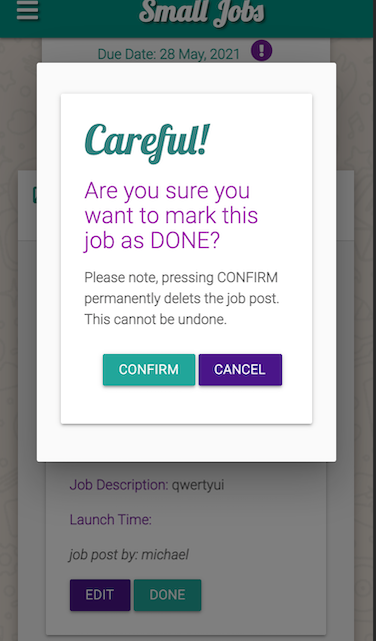
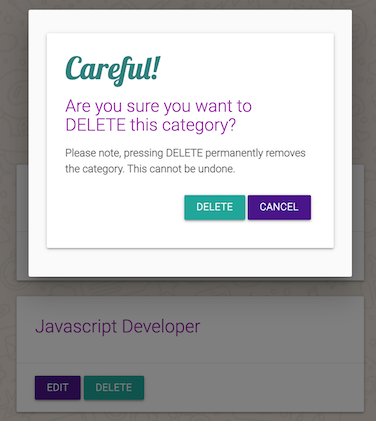
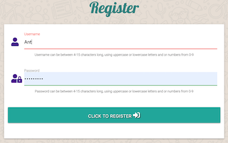
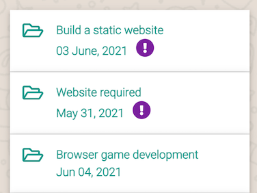
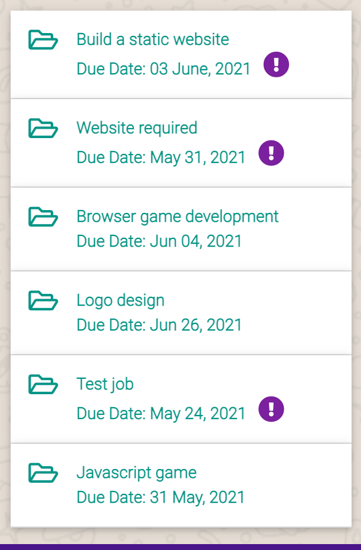
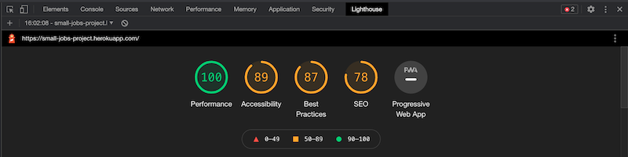
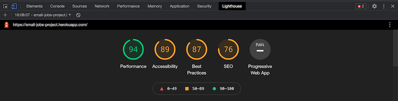

Back to [README](README.md)

---

# Contents

- [Testing User Stories](#user-stories)

- [Manual Testing](#manual-testing)
    - [Front End Testing](#front-end-testing)
    - [Back End Testing](#back-end-testing)

    - [Jinja For Looping and Routing Testing](#jinja-for-looping-and-routing-testing)

- [Chrome Dev Tools - Lighthouse](#chrome-dev-tools-lighthouse)
- [Responsiveness](#responsiveness)
- [Bugs](#bugs)

---

# Testing User Stories

## Testing UX

### Defensive Programming

In order users don't by accident delete their job post, I implemented defensive programming. So now if they click or tap the DONE button, a modal pops up with a message saying, Are you sure you want to mark this job as DONE? They can then either CANCEL, which closes the modal and the job post is left untouched or they can hit CONFIRM to delete the job and in doing so the job is removed from the database.

In order the Admin does not by accident delete a job category, I implemented defensive programming, same as above. If the Admin clicks or taps the DELETE button, a modal pops up with a message saying, Are you sure you want to delete this category? The Admin can then either CANCEL, which closes the modal and the category is left untouched or they can hit DELETE to delete the category and in doing so the category is removed from the database.

### Registration

In order to make the registration process as stress free as possible, I felt it would be good UX if I gave the user a sentence of the acceptence criteria, rather than them getting frustrated it they didn't supply the correct amount of characters and receiving no feedback as to why they were unsuccessful with registering.

### Nav Bar

In order to make the navbar always within the users' reach, I applied a fixed navbar to the main navbar. The navbar is also accessible by swiping to the left of your screen on mobile devices. Doing this makes the user feel comfortable knowing that they are never lost, so to speak, particularly for first time visitors this is important. 

### Due Date

I thought the dates on the jobs page was unclear what they meant to a first time visitor. So in order to make it clear to everyone, I added Due Date beside the date.
It's clearer from the images my reasons for doing this.

### EDIT and DONE Buttons

Changed the location for the EDIT and DONE buttons because where they were, made them hop about on mobile. It looked fine on desktop and laptop, just on mobile devices buttons got squashed and pushed the EDIT button down on to the line below. This spoiled the design anad UX for the user.

In order to address this issue, I put the buttons into the job description, which I think looks so much better. Job descriptions pop out without causing any problems to the design consistency.

[^ back to contents ^](#contents)

---

# Manual Testing

## Front End Testing

TEST            | OUTCOME                          | PASS / FAIL  
--------------- | -------------------------------- | ---------------
Ensure website passes HTML validators | Outcome info | PASS or FAIL
Ensure website passes CSS validators | CSS passes validation, no errors found | PASS
Ensure website passes JSHint validators | The script.js file passes the JSHint validation with just these two warnings: Two warnings
20	'let' is available in ES6 (use 'esversion: 6') or Mozilla JS extensions (use moz)
21	'let' is available in ES6 (use 'esversion: 6') or Mozilla JS extensions (use moz) | PASS
Ensure website passes PEP8 validators | The app.py file passes PEP8 validation without any errors | PASS
Ensure responsiveness of website across all major browsers | The website has been tested on Chrome, Safari, Firefox and Edge. The website displays as intended on desktop browsers and mobile browsers | PASS
Ensure the correct navigation items are displayed to the user when they are logged out | When a user logs out or when a new user visits the site, only HOME, ALL JOBS, REGISTER and LOGIN are visible | PASS
Ensure the correct navigation items are displayed to the user when they are logged in | The correct navigation items are displayed to the user when they are logged in. HOME, ALL JOBS, PROFILE, NEW JOBS, LOGOUT. When Admin is logged in MANAGE CATEGORIES is available | PASS
Ensure all navigation items redirect to their appropiate pages | All navigation items redirect to their appropiate pages | PASS
Ensure the footer is displayed on all pages with the correct links and social media links | The footer is displayed on all pages with the correct links and social media links. All links work and link to their appropiate pages and or websites | PASS
Ensure the All Jobs page works as intended with the appropiate functionality | The All Jobs page works as intended with the appropiate functionality. When the user taps or clicks on a job description, the job post with all relavant details pop out in a nice accordion affect | PASS
Ensure the register page works as intended with the appropiate functionality | The register page works as intended with the appropiate functionality. Username and Passwords can be between 4-15 characters long, using uppercase or lowercase letters and or numbers from 0-9 | PASS
Ensure the login page works as intended with the appropiate functionality | The login page works as intended with the appropiate functionality | PASS
Ensure the create job page works as intended with the appropiate functionality | The create job page works as intended with the appropiate functionality. Users fill out the required form and then SUBMIT the job which is then made public | PASS
Ensure the log out button works as intended with the appropiate functionality, ending the users' session | Tnsure the log out button works as intended with the appropiate functionality, ending the users' session. A flash message is displayed confirming them that they have been logged out | PASS
Ensure error pages, 404 and 500 works as intended | Error pages, 404 and 500 works as intended. Custom made error pages ensures the user stays on the website | PASS
Ensure job descriptions "pop out" when tapped or clicked | Job descriptions "pop out" when tapped or clicked | PASS
Ensure when you click on the EDIT button, within the Job Category dropdown list, the original selected category remains selected | When you click on the EDIT button, within the Job Category dropdown list, the original selected category remains selected | PASS
Ensure when you click on the EDIT button, within Business Name field, the original inputed field name is selected | When you click on the EDIT button, within Business Name field,the original inputed field name is selected | PASS
Ensure when you click on the EDIT button, within Contact Name field, the original inputed field name is selected | When you click on the EDIT button, within Contact Name field, the original inputed field name is selected | PASS
Ensure when you click on the EDIT button, within Contact Email field, the original inputed field name is selected | When you click on the EDIT button, within Contact Email field, the original inputed field name is selected | PASS
Ensure when you click on the EDIT button, within Job Name field, the original inputed field name is selected | When you click on the EDIT button, within Job Name field,the original inputed field name is selected | PASS
Ensure when you click on the EDIT button, within Job Description field, the original inputed field name is selected | When you click on the EDIT button, within Job Description field, the original inputed field name is selected | PASS
Ensure when you click on the EDIT button, within Due Date field, the original inputed date is selected | When you click on the EDIT button, within Due Date field, the original inputed date is selected | PASS
Ensure when you click on the EDIT button, within Launch Time field, the original inputed time is selected | When you click on the EDIT button, within Launch Time field the original inputed time is selected | PASS
Ensure when you click on the EDIT button, the Is Urgent toggle switch, the original selection is selected | When you click on the EDIT button, the Is Urgent toggle switch, the original selection is selected | PASS
Ensure when you click on the CANCEL button, the user is brought back to the main page, disregarding any changes | When you click on the CANCEL button, the user is brought back to the main page, disregarding any changes | PASS
When creating a job, ensure the job description dropdown select is added to the job post on the get_jobs page | The job description dropdown select is added to the job post on the get_jobs page. | PASS
When creating a job post, ensure the business name is added to the job post on the get_jobs page | When creating a job post, the business name is added to the job post on the get_jobs page | PASS
When creating a job post, ensure the contact name is added to the job post on the get_jobs page | When creating a job post, the contact name is added to the job post on the get_jobs page | PASS
When creating a job post, ensure the contact email is added to the job post on the get_jobs page | When creating a job post, the contact email is added to the job post on the get_jobs page | PASS
When creating a job post, ensure the job name is added to the job post on the get_jobs page | When creating a job post, the job name is added to the job post on the get_jobs page | PASS
When creating a job post, ensure the job description is added to the job post on the get_jobs page | When creating a job post, the job description is added to the job post on the get_jobs page | PASS
When creating a job post, ensure the due date is added to the job post on the get_jobs page | When creating a job post, the due date is added to the job post on the get_jobs page | PASS
When creating a job post, ensure the app launch time is added to the job post on the get_jobs page, if required by the user | When creating a job post, the app launch time is added to the job post on the get_jobs page, if required by the user | PASS
When creating a job post, ensure the is_urgent is added to the job post on the get_jobs page, if required by the user | When creating a job post, the is_urgent is added to the job post on the get_jobs page, if required by the user | PASS
When the EDIT button is clicked on a job, ensure the original Job Category selected entry is inputted and can be changed if required | When the EDIT button is clicked on a job, the original Job Category selected entry is inputted and can be changed if required | PASS
When the EDIT button is clicked on a job, ensure the original Business Name entry is inputted and can be changed if required | When the EDIT button is clicked on a job the original Business Name entry is inputted and can be changed if required | PASS
When the EDIT button is clicked on a job, ensure the original Contact Name entry is inputted and can be changed if required | When the EDIT button is clicked on a job, the original Contact Name entry is inputted and can be changed if required | PASS
When the EDIT button is clicked on a job, ensure the original Contact Email entry is inputted and can be changed if required | When the EDIT button is clicked on a job the original Contact Email entry is inputted and can be changed if required | PASS
When the EDIT button is clicked on a job, ensure the original Job Name entry is inputted and can be changed if required | When the EDIT button is clicked on a job, the original Job Name entry is inputted and can be changed if required | PASS
When the EDIT button is clicked on a job, ensure the original Job Description entry is inputted and can be changed if required | When the EDIT button is clicked on a job, the original Job Description entry is inputted and can be changed if required | PASS
When the EDIT button is clicked on a job, ensure the original Due Date entry is inputted and can be changed if required | When the EDIT button is clicked on a job, the original Due Date entry is inputted and can be changed if required | PASS
When the EDIT button is clicked on a job, ensure the original Launch Time entry is inputted and can be changed if required | When the EDIT button is clicked on a job the original Launch Time entry is inputted and can be changed if required | PASS
When the EDIT button is clicked on a job, ensure the original Is Urgent entry is selected and can be changed if required | When the EDIT button is clicked on a job, the original Is Urgent entry is selected and can be changed if required | PASS
Ensure clicking on the DONE button, a modal is displayed with a message cautioning the user | Clicking on the DONE button, a modal is displayed with a message cautioning the user | PASS
Within the modal, ensure the CONFIRM button deletes the job form the database | Within the modal, the CONFIRM button deletes the job form the database | PASS
Within the modal, ensure the CANCEL button closes the modal leaving the job untouched | Within the modal, the CANCEL button closes the modal leaving the job untouched | PASS
Ensure CREATE CATEGORY button on Manage Jobs page redirects the Admin to the Add A Category page | CREATE CATEGORY button on Manage Jobs page redirects the Admin to the Add A Category page | PASS
In categories.html, ensure the correct url_for for is passed into the href of the EDIT button | In categories.html, the correct url_for for is passed into the href of the EDIT button {{ url_for('edit_category', category_id=category.id) }} | PASS
In the edit_category.html page, ensure if the Admin does not want to make any changes, clicking the CANCEL, Admin is redirected back to the Manage Job Categories | In the edit_category.html page, if the Admin does not want to make any changes, clicking the CANCEL, Admin is redirected back to the Manage Job Categories | PASS
Ensure on the Edit A Category page when the Admin has finished editing the category, clicking on the EDIT submits the form, Admin is redirected back Manage Job Categories | On the Edit A Category page when the Admin has finished editing the category, clicking on the EDIT submits the form, Admin is redirected back Manage Job Categories | PASS
Within the categories.html page, ensure the delete button has the appropiate url_for, taking in the reguired argument | Within the categories.html page, ensure the delete button has the appropiate url_for, taking in the reguired argument - {{ url_for('delete_category', category_id=category._id) }} | PASS
Ensure a pop-up modal is displayed before the Admin deletes a category | A pop-up modal is displayed before the Admin deletes a category. This is done to prevent against accidental deletion | PASS
Within the jobs.html page ensure the search field takes in the appropiate url_for for action and "post" for method | jobs.html page ensure the search field takes in the appropiate url_for for action and "post" for method | PASS
Within the search div, ensure the RESET button reloads the jobs.html page taking in the appropiate url_for | Within the search div, the RESET button reloads the jobs.html page taking in the appropiate url_for | PASS
Within the search div, ensure the SEARCH button returns the correct query result when submitted | Within the search div, the SEARCH button returns the correct query result when submitted | PASS
Ensure if an incorrect address is typed into the web browser, a 404 error page is displayed | If an incorrect address is typed into the web browser, a 404 error page is displayed | PASS
Ensure if the user inadvertently does something to provoke a 400 Bad Request, the correct page is displayed telling them what occurred | If the user inadvertently does something to provoke a 400 Bad Request, the correct page is displayed telling them what occurred | PASS
Ensure if the user inadvertently does something to provoke a 401 Unauthorised Access, the correct page is displayed telling them what occurred | If the user inadvertently does something to provoke a 401 Unauthorised Access, the correct page is displayed telling them what occurred | PASS
Ensure if the web server unexpectedly goes down, the correct 500 error is displayed telling them what occurred | If the web server unexpectedly goes down, the correct 500 error is displayed telling them what occurred | PASS
Ensure the favicon displays correctly in the browser tab on Chrome | The favicon displays correctly in the browser tab on Chrome | PASS
Ensure the favicon displays correctly in the browser tab on Safari | The favicon displays correctly in the browser tab on Safari | PASS
Ensure the favicon displays correctly in the browser tab on Firefox | The favicon displays correctly in the browser tab on Firefox | PASS
Ensure the favicon displays correctly in the browser tab on Edge | The favicon displays correctly in the browser tab on Edge | PASS
Ensure the faviconv displays correctly with the appearance of an app logo on apple devices | The faviconv displays correctly with the appearance of an app logo on apple devices | PASS
Ensure the faviconv displays correctly with the appearance of an app logo on android devices | The faviconv displays correctly with the appearance of an app logo on android devices | PASS

[^ back to contents ^](#contents)

## Back End Testing

TEST            | OUTCOME                          | PASS / FAIL  
--------------- | -------------------------------- | ---------------
Ensure password is hashed using Werkzeug security features | Password is hashed using Werkzeug security features. Example of a hashed password generated for a new user. [Hashed](wireframes/password_hashing.png) | PASS
Ensure flash message is displayed when a new user registers | Flash message is displayed when a new user registers. [New user](wireframes/reg_success.png) | PASS
Ensure a flash message is displayed if a new user tries to register with an username that's already been registered | a flash message is displayed if a new user tries to register with an username that's already been registered. [Register fail](wireframes/reg_not_success.png) | PASS
Using RegEx defensive programming, ensure form is not submitted unless username and password are between 4-15 characters long | Users have to submit a username and password between 4-15 characters using a-z A-Z or 0-9. [Defensive programming](wireframes/defensive_prog.png) | PASS
Ensure a flash message is displayed to the user if incorrect details are entered | If the user enters an incorrect username or password a flash message is displayed. [Invalid details](wireframes/invalid_details.png) | PASS
Ensure a flash message is displayed to the user with their username when they login | A flash message is displayed to the user with their username when they login. [Username displayed](wireframes/correct_details.png) | PASS
Ensure user's username is displayed when they log in | User's username is displayed when they are logged. [Username displayed](wireframes/username_profile.png) | PASS
Ensure a flash message is displayed to the user when they log out and are redirected to the login pagee | A flash message is displayed to the user when they log out and they are redirected to the login page. [Log out flash message](wireframes/log_out_flash.png) | PASS
Ensure a flash message is displayed if incorrect login details are entered | A flash message is displayed if incorrect login details are entered. [Error message](wireframes/error_message.png) | PASS
Ensure forms have a "min-length" and a "max-length" set | All forms on the app have a "min-length" and a "max-length" | PASS
Ensure forms don't submit until all required fields are entered | Forms across the website do not submit unless all required fields are entered. | PASS
Ensure items in category dropdown are wired up to MongoDB | Items in category dropdown are wired up to MongoDB and appear alphabetically. | PASS
Ensure the correct input type is on all form entry fields | The correct input type is on all form entry fields. [Email input](wireframes/email_test.png) | PASS
Ensure dropdown job category list is marked as required | Dropdown job category list is marked as required. Turns red if unvalid and green if valid. [Correct validation](wireframes/valid.png) [Incorrect validation](wireframes/unvalid.png) | PASS
Ensure a flash message is displayed when a job is successfully added | A flash message is displayed when a job is successfully added. [Job added](wireframes/job_success_flash.png) | PASS
Ensure clicking on the edit button takes the user to the edit jobs page | Clicking on the edit button takes the user to the edit jobs page. | PASS
Ensure an appropiate Flash message is displayed to the user when they have updated their job | An appropiate Flash message is displayed to the user when they have updated their job. [Edit success](wireframes/edit_success.png) | PASS
Ensure if the user doesn't want to edit the job the CANCEL button redirects them to Job list page with all jobs | If the user doesn't want to edit the job the CANCEL button redirects them to Job list page with all jobs | PASS
Ensure DONE and EDIT buttons are only displayed to the appropiate user when logged in | DONE and EDIT buttons are only displayed to the appropiate user when logged in | PASS
Ensure DONE and EDIT buttons are not displayed to everyone | DONE and EDIT buttons are not displayed to everyone | PASS
Ensure registration instructions are visible to the user on the Register page | Registration instructions are visible to the user on the Register page [Registration instructions](wireframes/reg_inst.png) | PASS
Ensure when a job is deleted, a flash message is displayed to the user tellimg them so | When a job is deleted, a flash message is displayed to the user tellimg them so. [Flash message](wireframes/job_removed_flash.png) | PASS
Ensure when the Admin creates a new category a flash message is displayed on screen tellimg them so | When the Admin creates a new category a flash message is displayed on screen tellimg them so. [New category added](wireframes/new_cat.png) | PASS
When the Admin successfully updates a category, ensure an appropiate flash message is displayed | When the Admin successfully updates a category, a flash message is displayed. [Flash message](wireframes/cat_update.png) | PASS
When the Admin deletes a category, ensure an appropiate flash message is displayed | When the Admin deletes a category, an appropiate flash message is displayed [Flash message](wireframes/del_cat.png) | PASS

[^ back to contents ^](#contents)

## Jinja For Looping and Routing Testing

TEST            | OUTCOME                          | PASS / FAIL  
--------------- | -------------------------------- | ---------------
Ensure CATEGORIES on categories.html are converted into a list and are displayed alphabetically | CATEGORIES on categories.html are converted into a list and are displayed alphabetically | PASS
Ensure @app.route("/register") has the appropiate GET and POST methods | @app.route("/register") has the appropiate GET and POST methods | PASS
Ensure def register(): is connected to database to add a new user to the database | def register(): is connected to database which allows the user to be registered. Users can't register if a username already exists | PASS
Ensure @app.route("/get_jobs") takes in a function that returns the corrected rendered template and displays jobs as a list | @app.route("/get_jobs") takes in a function that returns the corrected rendered template and displays jobs as a list | PASS
Ensure @app.route(search) takes in the required GET and POST methods with correct routing | @app.route(search) takes in the required GET and POST methods with correct routing | PASS
Ensure the def search(): connects to the database and returns a query. It should also render the correct page taking in the correct variables | def search(): connects to the database and returns a query. It should also render the correct page taking in the correct variables | PASS
Ensure @app.route(login) takes in the required GET and POST methods with correct routing | @app.route(login) takes in the required GET and POST methods with correct routing | PASS
Ensure the def login(): connects to the database so users can correctly log back in again using the credentials used to register initially | def login(): connects to the database so users can correctly log back in again using the credentials used to register initially | PASS
Ensure @app.route(profile) takes in the required variable, GET and POST methods with correct routing | @app.route(profile) takes in the required variable, GET and POST methods with correct routing | PASS
Ensure def profile() contains the correct variable, grabs the session user's username from database and renders the correct page | def profile() contains the correct variable, grabs the session user's username from database and renders the correct page | PASS
Ensure @app.route(logout) has the correct routing | @app.route(logout) has the correct routing | PASS
Ensure def logout(): contains the correct functionality to remove user from session cookie | def logout(): contains the correct functionality to remove user from session cookie | PASS
Ensure @app.route("/get_categories") has the appropiate function and is routed in order to displayed the correct page | @app.route("/get_categories") has the appropiate function and is routed in order to displayed the correct page | PASS
Ensure Jinja for loop loops through the category list without any bugs showing | Jinja for loop loops through the category list without any bugs showing | PASS
Ensure Jinja If statement applied on the navbars, Manage Jobs page restricts access to the Admin only | Jinja If statement applied on the navbars, Manage Jobs page restricts access to the Admin only | PASS
Ensure @app.route("/add_category") has the appropiate GET and POST methods and returns the correct rendered page | @app.route("/add_category) has the appropiate GET and POST methods and returns the correct rendered page | PASS
In edit_category.html, ensure the action method has the appropiate url_for to complete the edit category request | In edit_category.html, the action method has the appropiate url_for to complete the edit category request: {{ url_for('edit_category', category_id=category.id) }} | PASS
Ensure the @app.route for edit_category has the appropiate decorator with the correct variables and methods | The @app.route for edit_category has the appropiate decorator with the correct variables and methods ("/edit_category/<category_id>", methods=["GET", "POST"]) | PASS
Ensure the def edit_category() has the correct variable in order to correctly display the data in BSON format and renders the correct page | The def edit_category() has the correct variable in order to correctly display the data in BSON format and renders the correct page | PASS
Ensure the @app.route for delete_category has the appropiate decorator with the correct variable | The @app.route for delete_category has the appropiate decorator with the correct variable ("/delete_category/<category_id>") | PASS
Ensure the def delete_category() contains the correct functionality in order to remove a category from the database | The def delete_category() contains the correct functionality in order to remove a category from the database | PASS
Ensure @app.route("/search") takes in the appropiate methods, GET and POST | @app.route("/search") takes in the appropiate methods, GET and POST | PASS
Ensure the def search() takes in the appropiate variables, connects to the database in order to return various search results and renders the correct page | The def search() takes in the appropiate variables, connects to the database in order to return various search results and renders the correct page | PASS
Ensure there is a conditional if block in place in case a search query returns no results | There is a conditional if block in place in case a search query returns no results | PASS
Ensure the @app.errorhandler takes in the appropiate variable, returns the correct rendered template in order to return a 404 Page Not Found | The @app.errorhandler takes in the appropiate variable, returns the correct rendered template in order to return a 404 Page Not Found | PASS
Ensure the @app.errorhandler takes in the appropiate variable, returns the correct rendered template in order to return a 400 Bad Request | The @app.errorhandler takes in the appropiate variable, returns the correct rendered template in order to return a 400 Bad Request | PASS
Ensure the @app.errorhandler takes in the appropiate variable, returns the correct rendered template in order to return a 401 Unauthorised | The @app.errorhandler takes in the appropiate variable, returns the correct rendered template in order to return a 401 Unauthorised | PASS
Ensure the @app.errorhandler takes in the appropiate variable, returns the correct rendered template in order to return a 500 Server Error | The @app.errorhandler takes in the appropiate variable, returns the correct rendered template in order to return a 500 Server Error | PASS

[^ back to contents ^](#contents)

---

# Chrome Dev Tools - Lighthouse

Lighthouse report generated for Desktop

Lighthouse report generated for Mobile

[^ back to contents ^](#contents)

---

# Responsiveness

The website responsiveness has been thoroughly tested on: 

1: Chrome, Safari, Firefox and Edge using MacBook

2: Chrome, Safari, Firefox and Edge using PC laptop 

3: Chrome, Safari, Firefox and Edge using iPhone

4: Chrome, Safari, Firefox and Edge using Android

Testing across multiple devices and laptops ensured website consistency throughout.

# Bugs 

## Job Category Dropdown

- Testing the live site on iPhone 11. On the edit_jobs page, I've noticed that the default dropdown menu is availaable to select an item as well as the styled Materialize. It's not there when I use Chrome Dev Tools to inspect the page.

    - Issue seemed to resolved itself

## Mobile Side Nav

- Having a bit of an issue trying to get the mobile side navigation to display when the hamburger menu is tapped.

    - Resloved this issue by ammending the file structure.

## Footer On Safari

- When viewd live on Safari mobile browser, the footer is not sticking to the bottom and it's not displaying its intended colour. Works fine in Safari on the laptop. [Footer issue image](wireframes/footer_issue.png).

    - Issue resolved itself. 

## Collapsable Jobs

- Testing on iPhone 11: In Firefox, job description aren't popping out. Works as intended on Safari, Chrome and Edge.

    - Issue has resolved itself

## Job Category Dropdown

- Testing on iPhone 11: On Safari, Firefox, Chrome and Edge can't select the category items. Works as intended on desktop.

    - It turns out it does work across the different mobile browsers, it's just a bit fussy where you tap.

## Routing Issue

- Experienced a [routing issue](wireframes/routing_error.png) that took longer than necessary to solve.

    - In my jobs.html file, I had {{ url_for('edit_job', job_id=job._id) }} instead of {{ url_for('edit_jobs', job_id=job._id) }}

[^ back to contents ^](#contents)

---
