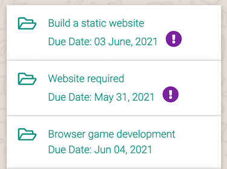

Back to [README](README.md)

---

# Contents

- [Testing User Stories](#user-stories)

- [Manual Testing](#manual-testing)
    - [Front End Testing](#front-end-testing)

    - [Back End Testing](#back-end-testing)
- [Chrome Dev Tools - Lighthouse](#chrome-dev-tools-lighthouse)
- [Responsiveness](#responsiveness)
- [Bugs](#bugs)

---

# Testing User Stories

## Testing UX

### Defensive Programming

In order users don't by accident delete their job post, I implemented defensive programming. So now if they click or tap the DONE button, a modal pops up with a message saying, Are you sure you want to mark this job as DONE? They can then either CANCEL, which closes the modal and the job post is left untouched or they can hit CONFIRM to delete the job and in doing so the job is removed from the database.

### Registration

In order to make the registration process as stress free as possible, I felt it would be good UX if I gave the user a sentence of the acceptence criteria, rather than them getting frustrated it they didn't supply the correct amount of characters and receiving no feedback as to why they were unsuccessful with registering.

### Nav Bar

In order to make the navbar always within the users' reach, I applied a fixed navbar to the main navbar. The navbar is also accessible by swiping to the left of your screen on mobile devices. Doing this makes the user feel comfortable knowing that they are never lost, so to speak, particularly for first time visitors this is important. 

### Due Date

I thought the dates on the jobs page was unclear what they meant to a first time visitor. So in order to make it clear to everyone, I added Due Date beside the date.
It's clearer from the images my reasons for doing this.

### EDIT and DONE Buttons

Changed the location for the EDIT and DONE buttons because where they were, made them hop about on mobile. It looked fine on desktop and laptop, just on mobile devices buttons got squashed and pushed the EDIT button down on to the line below. This spoiled the design anad UX for the user.

In order to address this issue, I put the buttons into the job description, which I think looks so much better. Job descriptions pop out without causing any problems to the design consistency.

[^ back to contents ^](#contents)

---

# Manual Testing

## Front End Testing

TEST            | OUTCOME                          | PASS / FAIL  
--------------- | -------------------------------- | ---------------
Ensure website passes HTML validators | Outcome info | PASS or FAIL
Ensure website passes CSS validators | Outcome info | PASS or FAIL
Ensure website passes Jhint validators | Outcome info | PASS or FAIL
Ensure website passes PEP8 validators | Outcome info | PASS or FAIL
Ensure responsiveness of website across all major browsers | Outcome info | Pass or Fail
Ensure the correct navigation items are displayed to the user when they are logged out | Outcome info |Pass or Fail
Ensure the correct navigation items are displayed to the user when they are logged in | Outcome info |Pass or Fail
Ensure all navigation items redirect to their appropiate pages | Outcome info | Pass or Fail
Ensure the footer is displayed on all pages with the correct links and social media links | Outcome info | Pass or Fail
Ensure the job description page works as intended with the appropiate functionality | Outcome info | Pass or Fail
Ensure the register page works as intended with the appropiate functionality | Outcome info | Pass or Fail
Ensure the login page works as intended with the appropiate functionality | Outcome info | Pass or Fail
Ensure the create job page works as intended with the appropiate functionality | Outcome info | Pass or Fail
Ensure the log out button works as intended with the appropiate functionality, ending the users' session | Outcome info | Pass or Fail
Ensure error pages, 404 and 500 works as intended | Outcome info | Pass or Fail
Ensure job descriptions "pop out" when tapped or clicked | Outcome info | Pass or Fail
Ensure when you click on the EDIT button, within the Job Category dropdown list, the original selected category remains selected | When you click on the EDIT button, within the Job Category dropdown list, the original selected category remains selected | PASS
Ensure when you click on the EDIT button, within Business Name field, the original inputed field name is selected | When you click on the EDIT button, within Business Name field,the original inputed field name is selected | PASS
Ensure when you click on the EDIT button, within Contact Name field, the original inputed field name is selected | When you click on the EDIT button, within Contact Name field, the original inputed field name is selected | PASS
Ensure when you click on the EDIT button, within Contact Email field, the original inputed field name is selected | When you click on the EDIT button, within Contact Email field, the original inputed field name is selected | PASS
Ensure when you click on the EDIT button, within Job Name field, the original inputed field name is selected | When you click on the EDIT button, within Job Name field,the original inputed field name is selected | PASS
Ensure when you click on the EDIT button, within Job Description field, the original inputed field name is selected | When you click on the EDIT button, within Job Description field, the original inputed field name is selected | PASS
Ensure when you click on the EDIT button, within Due Date field, the original inputed date is selected | When you click on the EDIT button, within Due Date field, the original inputed date is selected | PASS
Ensure when you click on the EDIT button, within Launch Time field, the original inputed time is selected | When you click on the EDIT button, within Launch Time field the original inputed time is selected | PASS
Ensure when you click on the EDIT button, the Is Urgent toggle switch, the original selection is selected | When you click on the EDIT button, the Is Urgent toggle switch, the original selection is selected | PASS
Ensure when you click on the CANCEL button, the user is brought back to the main page, disregarding any changes | When you click on the CANCEL button, the user is brought back to the main page, disregarding any changes | PASS
When creating a job, ensure the job description dropdown select is added to the job post on the get_jobs page | The job description dropdown select is added to the job post on the get_jobs page. | PASS
When creating a job post, ensure the business name is added to the job post on the get_jobs page | When creating a job post, the business name is added to the job post on the get_jobs page | PASS
When creating a job post, ensure the contact name is added to the job post on the get_jobs page | When creating a job post, the contact name is added to the job post on the get_jobs page | PASS
When creating a job post, ensure the contact email is added to the job post on the get_jobs page | When creating a job post, the contact email is added to the job post on the get_jobs page | PASS
When creating a job post, ensure the job name is added to the job post on the get_jobs page | When creating a job post, the job name is added to the job post on the get_jobs page | PASS
When creating a job post, ensure the job description is added to the job post on the get_jobs page | When creating a job post, the job description is added to the job post on the get_jobs page | PASS
When creating a job post, ensure the due date is added to the job post on the get_jobs page | When creating a job post, the due date is added to the job post on the get_jobs page | PASS
When creating a job post, ensure the app launch time is added to the job post on the get_jobs page, if required by the user | When creating a job post, the app launch time is added to the job post on the get_jobs page, if required by the user | PASS
When creating a job post, ensure the is_urgent is added to the job post on the get_jobs page, if required by the user | When creating a job post, the is_urgent is added to the job post on the get_jobs page, if required by the user | PASS
When the EDIT button is clicked on a job, ensure the original Job Category selected entry is inputted and can be changed if required | When the EDIT button is clicked on a job, the original Job Category selected entry is inputted and can be changed if required | PASS
When the EDIT button is clicked on a job, ensure the original Business Name entry is inputted and can be changed if required | When the EDIT button is clicked on a job the original Business Name entry is inputted and can be changed if required | PASS
When the EDIT button is clicked on a job, ensure the original Contact Name entry is inputted and can be changed if required | When the EDIT button is clicked on a job, the original Contact Name entry is inputted and can be changed if required | PASS
When the EDIT button is clicked on a job, ensure the original Contact Email entry is inputted and can be changed if required | When the EDIT button is clicked on a job the original Contact Email entry is inputted and can be changed if required | PASS
When the EDIT button is clicked on a job, ensure the original Job Name entry is inputted and can be changed if required | When the EDIT button is clicked on a job, the original Job Name entry is inputted and can be changed if required | PASS
When the EDIT button is clicked on a job, ensure the original Job Description entry is inputted and can be changed if required | When the EDIT button is clicked on a job, the original Job Description entry is inputted and can be changed if required | PASS
When the EDIT button is clicked on a job, ensure the original Due Date entry is inputted and can be changed if required | When the EDIT button is clicked on a job, the original Due Date entry is inputted and can be changed if required | PASS
When the EDIT button is clicked on a job, ensure the original Launch Time entry is inputted and can be changed if required | When the EDIT button is clicked on a job the original Launch Time entry is inputted and can be changed if required | PASS
When the EDIT button is clicked on a job, ensure the original Is Urgent entry is selected and can be changed if required | When the EDIT button is clicked on a job, the original Is Urgent entry is selected and can be changed if required | PASS
Ensure clicking on the DONE button, a modal is displayed with a message cautioning the user | Clicking on the DONE button, a modal is displayed with a message cautioning the user | PASS
Within the modal, ensure the CONFIRM button deletes the job form the database | Within the modal, the CONFIRM button deletes the job form the database | PASS
Within the modal, ensure the CANCEL button closes the modal leaving the job untouched | Within the modal, the CANCEL button closes the modal leaving the job untouched | PASS
Ensure CREATE CATEGORY button on Manage Jobs page redirects the Admin to the Add A Category page | CREATE CATEGORY button on Manage Jobs page redirects the Admin to the Add A Category page | PASS

## Back End Testing

TEST            | OUTCOME                          | PASS / FAIL  
--------------- | -------------------------------- | ---------------
Ensure password is hashed using Werkzeug security features | Password is hashed using Werkzeug security features. Example of a hashed password generated for a new user. [Hashed](wireframes/password_hashing.png) | PASS
Ensure flash message is displayed when a new user registers | Flash message is displayed when a new user registers. [New user](wireframes/reg_success.png) | PASS
Ensure a flash message is displayed if a new user tries to register with an username that's already been registered | a flash message is displayed if a new user tries to register with an username that's already been registered. [Register fail](wireframes/reg_not_success.png) | PASS
Using RegEx defensive programming, ensure form is not submitted unless username and password are between 4-15 characters long | Users have to submit a username and password between 4-15 characters using a-z A-Z or 0-9. [Defensive programming](wireframes/defensive_prog.png) | PASS
Ensure a flash message is displayed to the user if incorrect details are entered | If the user enters an incorrect username or password a flash message is displayed. [Invalid details](wireframes/invalid_details.png) | PASS
Ensure a flash message is displayed to the user with their username when they login | A flash message is displayed to the user with their username when they login. [Username displayed](wireframes/correct_details.png) | PASS
Ensure user's username is displayed when they log in | User's username is displayed when they are logged. [Username displayed](wireframes/username_profile.png) | PASS
Ensure a flash message is displayed to the user when they log out and are redirected to the login pagee | A flash message is displayed to the user when they log out and they are redirected to the login page. [Log out flash message](wireframes/log_out_flash.png) | PASS
Ensure a flash message is displayed if incorrect login details are entered | A flash message is displayed if incorrect login details are entered. [Error message](wireframes/error_message.png) | PASS
Ensure forms have a "min-length" and a "max-length" set | All forms on the app have a "min-length" and a "max-length" | PASS
Ensure forms don't submit until all required fields are entered | Forms across the website do not submit unless all required fields are entered. | PASS
Ensure items in category dropdown are wired up to MongoDB | Items in category dropdown are wired up to MongoDB and appear alphabetically. | PASS
Ensure the correct input type is on all form entry fields | The correct input type is on all form entry fields. [Email input](wireframes/email_test.png) | PASS
Ensure dropdown job category list is marked as required | Dropdown job category list is marked as required. Turns red if unvalid and green if valid. [Correct validation](wireframes/valid.png) [Incorrect validation](wireframes/unvalid.png) | PASS
Ensure a flash message is displayed when a job is successfully added | A flash message is displayed when a job is successfully added. [Job added](wireframes/job_success_flash.png) | PASS
Ensure clicking on the edit button takes the user to the edit jobs page | Clicking on the edit button takes the user to the edit jobs page. | PASS
Ensure an appropiate Flash message is displayed to the user when they have updated their job | An appropiate Flash message is displayed to the user when they have updated their job. [Edit success](wireframes/edit_success.png) | PASS
Ensure if the user doesn't want to edit the job the CANCEL button redirects them to Job list page with all jobs | If the user doesn't want to edit the job the CANCEL button redirects them to Job list page with all jobs | PASS
Ensure DONE and EDIT buttons are only displayed to the appropiate user when logged in | DONE and EDIT buttons are only displayed to the appropiate user when logged in | PASS
Ensure DONE and EDIT buttons are not displayed to everyone | DONE and EDIT buttons are not displayed to everyone | PASS
Ensure registration instructions are visible to the user on the Register page | Registration instructions are visible to the user on the Register page [Registration instructions](wireframes/reg_inst.png) | PASS
Ensure when a job is deleted, a flash message is displayed to the user tellimg them so | When a job is deleted, a flash message is displayed to the user tellimg them so. [Flash message](wireframes/job_removed_flash.png) | PASS
Ensure when the Admin creates a new category a flash message is displayed on screen tellimg them so | When the Admin creates a new category a flash message is displayed on screen tellimg them so. [New category added](wireframes/new_cat.png) | PASS

## Jinja, For Looping and Routing Testing

TEST            | OUTCOME                          | PASS / FAIL  
--------------- | -------------------------------- | ---------------
Ensure CATEGORIES on categories.html are converted into a list and are displayed alphabetically | CATEGORIES on categories.html are converted into a list and are displayed alphabetically | PASS
Ensure @app.route("/get_categories") has the appropiate function and is routed in order to displayed the correct page | @app.route("/get_categories") has the appropiate function and is routed in order to displayed the correct page | PASS
Ensure Jinja for loop loops through the category list without any bugs showing | Jinja for loop loops through the category list without any bugs showing | PASS
Ensure Jinja If statement applied on the navbars, Manage Jobs page restricts access to the Admin only | Jinja If statement applied on the navbars, Manage Jobs page restricts access to the Admin only | PASS
Ensure @app.route("/add_category) has the appropiate GET and POST methods and returns the correct rendered page | @app.route("/add_category) has the appropiate GET and POST methods and returns the correct rendered page | PASS

[^ back to contents ^](#contents)

---

# Chrome Dev Tools - Lighthouse

Lighthouse info goes here

[^ back to contents ^](#contents)

---

# Responsiveness

[^ back to contents ^](#contents)

---

# Bugs 

## Job Category Dropdown

- Testing the live site on iPhone 11. On the edit_jobs page, I've noticed that the default dropdown menu is availaable to select an item as well as the styled Materialize. It's not there when I use Chrome Dev Tools to inspect the page.

    - Issue seemed to resolved itself

## Mobile Side Nav

- Having a bit of an issue trying to get the mobile side navigation to display when the hamburger menu is tapped.

    - Resloved this issue by ammending the file structure.

## Footer On Safari

- When viewd live on Safari mobile browser, the footer is not sticking to the bottom and it's not displaying its intended colour. Works fine in Safari on the laptop. [Footer issue image](wireframes/footer_issue.png).

    - Issue resolved itself. 

## Collapsable Jobs

- Testing on iPhone 11: In Firefox, job description aren't popping out. Works as intended on Safari, Chrome and Edge.

    - Issue has resolved itself

## Job Category Dropdown

- Testing on iPhone 11: On Safari, Firefox, Chrome and Edge can't select the category items. Works as intended on desktop.

    - It turns out it does work across the different mobile browsers, it's just a bit fussy where you tap.

## Routing Issue

- Experienced a [routing issue](wireframes/routing_error.png) that took longer than necessary to solve.

    - In my jobs.html file, I had {{ url_for('edit_job', job_id=job._id) }} instead of {{ url_for('edit_jobs', job_id=job._id) }}

[^ back to contents ^](#contents)

---
