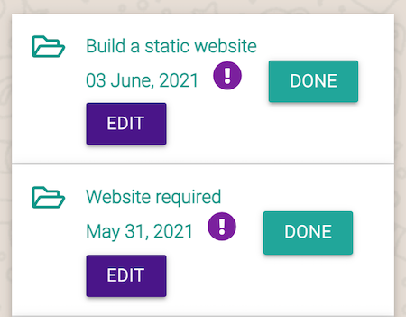
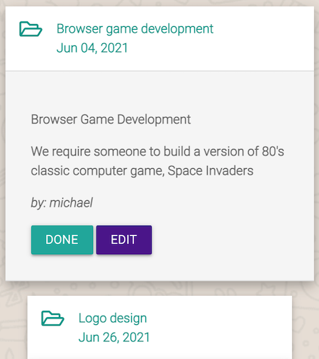

Back to [README](README.md)

---

# Contents

- [Testing User Stories](#user-stories)

- [Manual Testing](#manual-testing)
    - [Front End Testing](#front-end-testing)

    - [Back End Testing](#back-end-testing)
- [Chrome Dev Tools - Lighthouse](#chrome-dev-tools-lighthouse)
- [Responsiveness](#responsiveness)
- [Bugs](#bugs)

---

# Testing User Stories

## Testing UX

Changed the location for the EDIT and DONE buttons because where they were, made them hop about on mobile. It looked fine on desktop and laptop, just on mobile devices, buttons got squashed and pushed the EDIT button down on to the line below. This spoiled the design anad UX for the user.

In order to address this issue, I put the buttons into the job description, which I think looks so much better. Job descriptions pop out without causing any problems to the design consistency.

[^ back to contents ^](#contents)

---

# Manual Testing

## Front End Testing

TEST            | OUTCOME                          | PASS / FAIL  
--------------- | -------------------------------- | ---------------
Ensure website passes HTML validators | Outcome info | PASS or FAIL
Ensure website passes CSS validators | Outcome info | PASS or FAIL
Ensure website passes Jhint validators | Outcome info | PASS or FAIL
Ensure website passes PEP8 validators | Outcome info | PASS or FAIL
Ensure responsiveness of website across all major browsers | Outcome info | Pass or Fail
Ensure the correct navigation items are displayed to the user when they are logged out | Outcome info |Pass or Fail
Ensure the correct navigation items are displayed to the user when they are logged in | Outcome info |Pass or Fail
Ensure all navigation items redirect to their appropiate pages | Outcome info | Pass or Fail
Ensure the footer is displayed on all pages with the correct links and social media links | Outcome info | Pass or Fail
Ensure the job description page works as intended with the appropiate functionality | Outcome info | Pass or Fail
Ensure the register page works as intended with the appropiate functionality | Outcome info | Pass or Fail
Ensure the login page works as intended with the appropiate functionality | Outcome info | Pass or Fail
Ensure the create job page works as intended with the appropiate functionality | Outcome info | Pass or Fail
Ensure the log out button works as intended with the appropiate functionality, ending the users' session | Outcome info | Pass or Fail
Ensure error pages, 404 and 500 works as intended | Outcome info | Pass or Fail
Ensure job descriptions "pop out" when tapped or clicked | Outcome info | Pass or Fail

## Back End Testing

TEST            | OUTCOME                          | PASS / FAIL  
--------------- | -------------------------------- | ---------------
Ensure password is hashed using Werkzeug security features | Password is hashed using Werkzeug security features. Example of a hashed password generated for a new user. [Hashed](wireframes/password_hashing.png) | PASS
Ensure flash message is displayed when a new user registers | Flash message is displayed when a new user registers. [New user](wireframes/reg_success.png) | PASS
Ensure a flash message is displayed if a new user tries to register with an username that's already been registered | a flash message is displayed if a new user tries to register with an username that's already been registered. [Register fail](wireframes/reg_not_success.png) | PASS
Using RegEx defensive programming, ensure form is not submitted unless username and password are between 4-15 characters long | Users have to submit a username and password between 4-15 characters using a-z A-Z or 0-9. [Defensive programming](wireframes/defensive_prog.png) | PASS
Ensure a flash message is displayed to the user if incorrect details are entered | If the user enters an incorrect username or password a flash message is displayed. [Invalid details](wireframes/invalid_details.png) | PASS
Ensure a flash message is displayed to the user with their username when they login | A flash message is displayed to the user with their username when they login. [Username displayed](wireframes/correct_details.png) | PASS
Ensure user's username is displayed when they log in | User's username is displayed when they are logged. [Username displayed](wireframes/username_profile.png) | PASS
Ensure a flash message is displayed to the user when they log out and are redirected to the login pagee | A flash message is displayed to the user when they log out and they are redirected to the login page. [Log out flash message](wireframes/log_out_flash.png) | PASS
Ensure a flash message is displayed if incorrect login details are entered | A flash message is displayed if incorrect login details are entered. [Error message](wireframes/error_message.png) | PASS
Ensure forms have a "min-length" and a "max-length" set | All forms on the app have a "min-length" and a "max-length" | PASS
Ensure forms don't submit until all required fields are entered | Forms across the website do not submit unless all required fields are entered. | PASS
Ensure items in category dropdown are wired up to MongoDB | Items in category dropdown are wired up to MongoDB and appear alphabetically. | PASS
Ensure the correct input type is on all form entry fields | The correct input type is on all form entry fields. [Email input](wireframes/email_test.png) | PASS
Ensure dropdown job category list is marked as required | Dropdown job category list is marked as required. Turns red if unvalid and green if valid. [Correct validation](wireframes/valid.png) [Incorrect validation](wireframes/unvalid.png) | PASS
Ensure a flash message is displayed when a job is successfully added | A flash message is displayed when a job is successfully added. [Job added](wireframes/job_success_flash.png)
Ensure clicking on the edit button takes the user to the edit jobs page | Clicking on the edit button takes the user to the edit jobs page. | PASS

[^ back to contents ^](#contents)

---

# Chrome Dev Tools - Lighthouse

Lighthouse info goes here

[^ back to contents ^](#contents)

---

# Responsiveness

[^ back to contents ^](#contents)

---

# Bugs 

## Mobile Side Nav

- Having a bit of an issue trying to get the mobile side navigation to display when the hamburger menu is tapped.

    - It's probably something very small which I'll resolve later.
        - Resloved this issue by ammending the file structure.

## Footer On Safari

- When viewd live on Safari mobile browser, the footer is not sticking to the bottom and it's not displaying its intended colour. Works fine in Safari on the laptop. [Footer issue image](wireframes/footer_issue.png).

    - Issue resolved itself. 

## Collapsable Jobs

- Testing on iPhone 11: In Firefox, job description aren't popping out. Works as intended on Safari, Chrome and Edge.

    - Issue has resolved itself

## Job Category Dropdown

- Testing on iPhone 11: On Safari, Firefox, Chrome and Edge can't select the category items. Works as intended on desktop.

    - Will try to find a resolution.
        - It turns out it does work across the different mobile browsers, it's just a bit fussy where you tap.

## Routing Issue

- Experienced a [routing issue](wireframes/routing_error.png) that took longer than necessary to solve.

    - In my jobs.html file, I had {{ url_for('edit_job', job_id=job._id) }} instead of {{ url_for('edit_jobs', job_id=job._id) }}

[^ back to contents ^](#contents)

---
